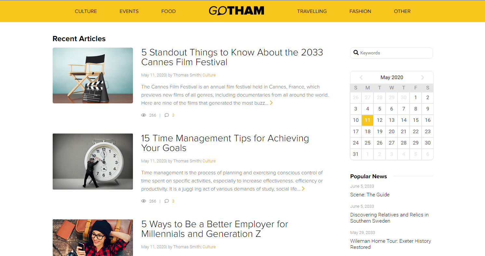

# Gotham Website

> This was a small project creating a single page blog site. 

---
### Link To Project

See the [Project Name](project-url) on Linkify.

---

### Table of Contents

- [Description](#description)
- [How To Use](#how-to-use)
- [References](#references)
- [License](#license)
- [Author Info](#author-info)

---

## Description

This was a basic blog site that has a calendar, and articles listed. It uses a little bootstrap and flexbox. Not a functioning blog site but intended to be practice in a bootcamp course. 

Project based on [The Result-Oriented Web Developer Course - BOOTCAMP 2020](https://www.udemy.com/course/result-oriented-web-developer-course/)

#### Technologies

- HTML5, CSS3
- Bootstrap
- Flexbox

[Back To The Top](#gotham-website)

---

## How To Use

#### Installation

#### API Reference

none.

[Back To The Top](#gotham-website)

---

## References
[Back To The Top](#gotham-website)

---

## License

MIT License

Copyright (c) [2020] [Bryan Lundeen]

Permission is hereby granted, free of charge, to any person obtaining a copy
of this software and associated documentation files (the "Software"), to deal
in the Software without restriction, including without limitation the rights
to use, copy, modify, merge, publish, distribute, sublicense, and/or sell
copies of the Software, and to permit persons to whom the Software is
furnished to do so, subject to the following conditions:

The above copyright notice and this permission notice shall be included in all
copies or substantial portions of the Software.

THE SOFTWARE IS PROVIDED "AS IS", WITHOUT WARRANTY OF ANY KIND, EXPRESS OR
IMPLIED, INCLUDING BUT NOT LIMITED TO THE WARRANTIES OF MERCHANTABILITY,
FITNESS FOR A PARTICULAR PURPOSE AND NONINFRINGEMENT. IN NO EVENT SHALL THE
AUTHORS OR COPYRIGHT HOLDERS BE LIABLE FOR ANY CLAIM, DAMAGES OR OTHER
LIABILITY, WHETHER IN AN ACTION OF CONTRACT, TORT OR OTHERWISE, ARISING FROM,
OUT OF OR IN CONNECTION WITH THE SOFTWARE OR THE USE OR OTHER DEALINGS IN THE
SOFTWARE.

[Back To The Top](#gotham-website)

---

## Author Info

- Github - [lundeen-bryan](https://github.com/lundeen-bryan)
- LinkedIn - [BryanLundeen](https://www.linkedin.com/in/bryanlundeen/)

[Back To The Top](#gotham-website)
